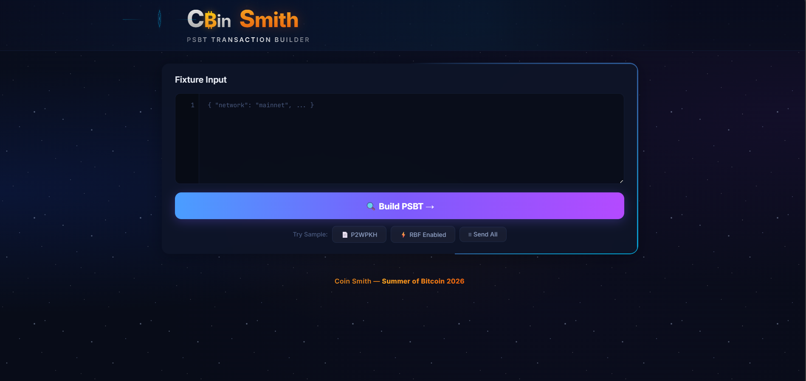

# 🪙 Coin Smith

> A Bitcoin PSBT transaction builder I built for the **Summer of Bitcoin 2026** challenge (Week 2).

Coin Smith takes a set of UTXOs, payment targets, and a fee rate — then selects coins, computes fees/change, and produces a fully valid unsigned **PSBT (BIP-174)**. It ships with a CLI for machine-checkable output and a web visualizer that explains everything in plain English.


---

## 🎬 Demo

📹 **[Watch the walkthrough on YouTube](https://youtu.be/Uqjff56Q0IM)** (< 2 min)

---

## 📸 Screenshot



---

## ✨ What it does

### Coin Selection & Transaction Building

- Parses fixture inputs defensively — rejects malformed UTXOs, addresses, amounts
- Implements coin selection strategy (greedy) with support for `policy.max_inputs` enforcement
- Computes accurate **vbytes** estimation across all script types (P2PKH, P2SH-P2WPKH, P2WPKH, P2WSH, P2TR)
- Calculates fees from target `fee_rate_sat_vb` × estimated vbytes
- Smart change handling — only creates change when it's above the dust threshold (546 sats)
- Handles edge cases: send-all (no change), dust change absorption, fee/change boundary conditions

### PSBT Generation

- Builds valid **BIP-174 PSBTs** with `bitcoinjs-lib`
- Includes `witness_utxo` metadata for each input
- Correct `nSequence` and `nLockTime` per BIP-125 (RBF) and locktime rules
- Anti-fee-sniping support (`nLockTime = current_height` when applicable)
- Base64 encoded output ready for hardware wallet signing

### RBF & Locktime

- Full RBF signaling via `nSequence` (BIP-125)
- Absolute locktime support (block height and unix timestamp)
- Anti-fee-sniping: sets `nLockTime = current_height` when `rbf: true` and no explicit locktime
- Correct interaction matrix between `rbf`, `locktime`, and `current_height` fields

### Warnings & Safety

- `HIGH_FEE` — fee > 1M sats or rate > 200 sat/vB
- `DUST_CHANGE` — change output below 546 sats
- `SEND_ALL` — no change created, leftover consumed as fee
- `RBF_SIGNALING` — transaction opts into Replace-By-Fee

### Web Visualizer

- Dark-themed UI with clean layout
- Paste fixture JSON to build a PSBT instantly
- Visual breakdown of selected inputs → payment outputs + change
- Fee, fee rate, vbytes display
- RBF signaling indicator and locktime info
- Warning badges with explanations
- Health endpoint at `GET /api/health`

---

## 🏗️ Project Structure

```
coin-smith/
├── src/
│   ├── cli.ts              # CLI entry point — fixture → JSON report
│   ├── coin-selection.ts   # UTXO selection algorithm
│   ├── psbt-builder.ts     # PSBT construction with bitcoinjs-lib
│   ├── rbf-locktime.ts     # RBF signaling & locktime logic
│   ├── weight.ts           # vbytes estimation per script type
│   ├── validate.ts         # Input validation & error handling
│   ├── warnings.ts         # Warning detection (high fee, dust, etc.)
│   ├── types.ts            # TypeScript interfaces
│   ├── server.ts           # Express server for web UI
│   └── __tests__/
│       ├── coin-selection.test.ts
│       ├── rbf-locktime.test.ts
│       ├── validate.test.ts
│       └── weight.test.ts
├── public/
│   ├── index.html          # Web UI
│   ├── style.css           # Styling (dark theme)
│   └── app.js              # Frontend logic & rendering
├── fixtures/               # 24 test fixtures (various scenarios)
├── cli.sh                  # CLI runner script
├── web.sh                  # Web server runner script
└── setup.sh                # Dependency installer
```

---

## 🚀 Getting Started

### Prerequisites

- **Node.js** (v18+)
- **npm**

### Setup

```bash
bash setup.sh
```

### Run the CLI

```bash
# Basic P2WPKH transaction with change
bash cli.sh fixtures/basic_change_p2wpkh.json

# Send-all (no change)
bash cli.sh fixtures/send_all_dust_change.json

# RBF with locktime
bash cli.sh fixtures/rbf_with_locktime.json
```

Output goes to `out/<fixture_name>.json`.

### Run Tests

```bash
npm test
```

### Run the Web UI

```bash
bash web.sh
# → http://127.0.0.1:3000
```

---

## 🔧 How it works

1. **Validation** — Parse the fixture JSON and validate every field: UTXOs must have valid txids (64 hex chars), amounts must be positive, scriptPubKeys must match claimed script types, addresses must be valid for the network.

2. **Coin Selection** — I use a greedy algorithm that sorts UTXOs by value (largest first) and selects until we have enough to cover payments + estimated fee. It respects `policy.max_inputs` if set.

3. **Fee Calculation** — Estimate vbytes based on input/output script types (each type has a known weight contribution). Fee = `ceil(fee_rate × vbytes)`. The tricky part is that adding/removing a change output changes the vbytes, which changes the fee — so it requires iteration.

4. **Change Logic** — If `inputs - payments - fee ≥ 546` (dust threshold), create a change output. Otherwise, the leftover gets absorbed into the fee (send-all). Never create dust outputs.

5. **PSBT Construction** — Using `bitcoinjs-lib`, build the unsigned transaction with correct `nVersion`, `nLockTime`, and per-input `nSequence` values. Attach `witness_utxo` data for each input. Serialize as base64.

6. **RBF/Locktime** — Follow the interaction matrix between `rbf`, `locktime`, and `current_height` to set the correct `nSequence` and `nLockTime` values.

---

## 📋 Output Format

```json
{
  "ok": true,
  "network": "mainnet",
  "strategy": "greedy",
  "selected_inputs": [...],
  "outputs": [
    { "n": 0, "value_sats": 70000, "script_type": "p2wpkh", "is_change": false },
    { "n": 1, "value_sats": 29300, "script_type": "p2wpkh", "is_change": true }
  ],
  "change_index": 1,
  "fee_sats": 700,
  "fee_rate_sat_vb": 5.0,
  "vbytes": 140,
  "rbf_signaling": true,
  "locktime": 850000,
  "locktime_type": "block_height",
  "psbt_base64": "cHNidP8BAFICAAAA...",
  "warnings": [{ "code": "RBF_SIGNALING" }]
}
```

---

## 🧪 Tests

4 test suites covering:

| Suite | What it tests |
|-------|--------------|
| `coin-selection.test.ts` | Selection algorithm, insufficient funds, max_inputs policy |
| `weight.test.ts` | vbytes estimation for all script types |
| `rbf-locktime.test.ts` | All combinations of rbf/locktime/current_height |
| `validate.test.ts` | Input validation, error handling, edge cases |

---

## 🛠️ Tech Stack

| Layer | Tech |
|-------|------|
| Language | TypeScript |
| Runtime | Node.js |
| Server | Express |
| Bitcoin | bitcoinjs-lib, ecpair, tiny-secp256k1 |
| Testing | Jest + ts-jest |
| Frontend | Vanilla HTML/CSS/JS |

---

## 📝 What I learned

This project taught me how Bitcoin wallets actually work under the hood — how coin selection isn't just "pick UTXOs until you have enough" but involves carefully balancing fees, change outputs, and dust rules. The fee/change circular dependency (adding change changes the size, which changes the fee, which might eliminate the change) was surprisingly tricky to get right.

Building the PSBT from scratch also gave me a deeper understanding of BIP-174 and why the signing workflow is split into creation → signing → finalization steps.

---

## 📄 License

MIT — see [LICENSE](LICENSE).

Built as part of the [Summer of Bitcoin 2026](https://www.summerofbitcoin.org/) developer challenge.
